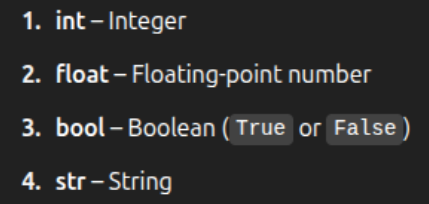
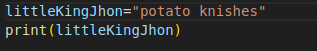
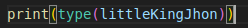
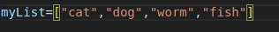
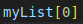
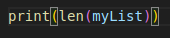
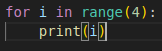
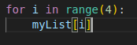

hi kayt:3

I made this as like a thingy for u because i want to try help u learn. I dunno.

its not like super in depth or anything just like the order you should go about things.Maybe ill get you to do some more stuff if it helps hehe

i put some links for like each part, you dont need to like read through them or anything they are just sort of there if you want (i kinda read through them enough to think that they where ok, but they might be dumb AI is pretty good at explaining stuff to so thats pretty good honestly sometimes better then some of these pages half the time)

hugs and smooches gl
# primative types; 
- ### make a variable of each primative type


like technically there are more, but they are kind of autistic 


- ### print each of your primative type variables using pythons print function 

- ### after you have printed each primitave type variable print each one with pythons type function 


this will just tell you what type the input variable is  (you will probably use this a lot for debugging)

### hi kayt :3 lwinks own the kwey twopics
- primative types https://www.geeksforgeeks.org/primitive-data-types-vs-non-primitive-data-types-in-python/
- python type function https://www.geeksforgeeks.org/python-type-function/

# Lists;
 oke so now that we have done the baby stuff we can move on to things
 that get a little more interesting
 
 
 we are going to take a look at lists
 - a list is a container that can fit multiple elements inside of it 
 - a list can be indexed with an int to get that index
 - indexing starts at 0; if we want to get the first item we use [0],<br> if we want the second item we use [1],<br>
 if we want the third we use [2],<br> some launguages start at 1 (we dont like those)

<br> 
 this is how we can define a simple list with some nice things inside it.
 
 
 <br>this is how we get those nice things from our list ```indexing```; this will give us ```cat``` since it is the ```1st``` element in the list
 
 

this will give us ```fish``` since it is the ```4th``` element in the list 
 
- ### lets try print worm by ```indexing``` it   :3

- ### lets print the length of our list with the ```len()``` function
    

### hi kayt :3 lwinks own the kwey twopics
- python lists https://www.geeksforgeeks.org/python-lists/
- python ```len()``` function https://www.geeksforgeeks.org/python-len-function/


# for loops
 loops are your friend. we are going to try make a basic loop to print each item in our list


make this little baby right here and run it :3



<br> the variable ```i``` will increment by 1 each time the loop is run  
the loop will run 4 times (it will start with 0 and end with 3) 

now we have another thing that goes 0-3 which is our list from before

when we index a number its not just bound to 1,2,3,4... we just need to use type  ```int``` when we index. so we can use our variable ```i``` instead.

lets run this rq



### hi kayt :3 lwinks own the kwey twopics
- python for loop https://www.geeksforgeeks.org/python-loop-through-a-range/

